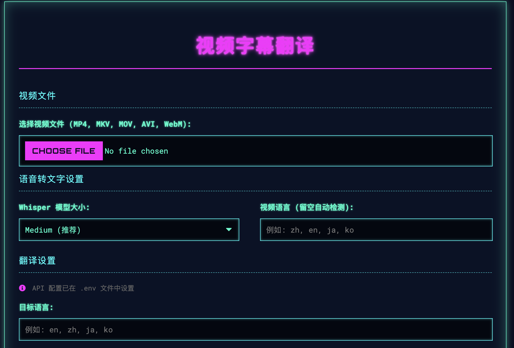
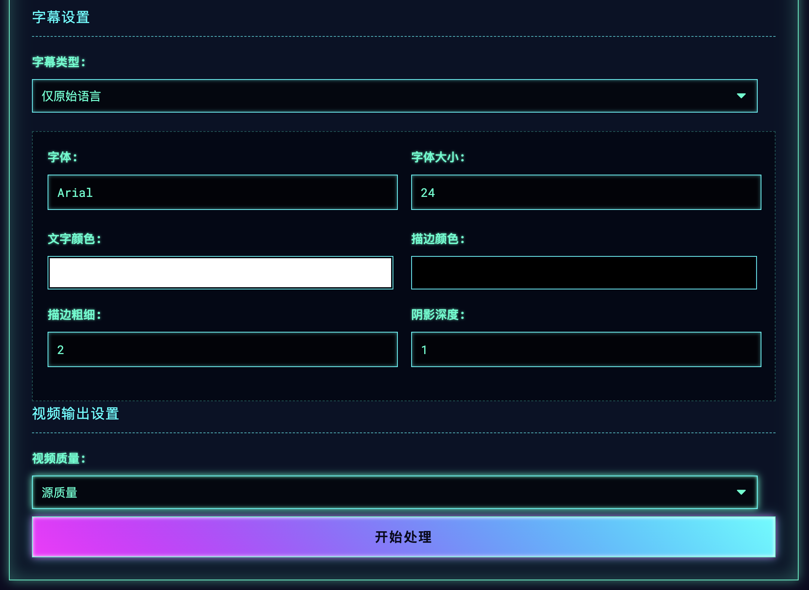

<div align="center">
  <h1>🎬 Video Subtitle Translator</h1>
  <p>✨ A powerful video subtitle generation and translation tool supporting multi-language conversion and customizable subtitle styles</p>
  
  [](https://www.python.org/)
  [](https://flask.palletsprojects.com/)
  [](https://openai.com/research/whisper)
  
  
  
  *Figure 1: Main Application Interface - Upload Video and Set Translation Options*

  [中文版 (Chinese Version)](README_CN.md)
</div>

## 🌟 Key Features

### 🎥 Video Processing
- Support for multiple video formats (MP4, MKV, MOV, AVI, WebM)
- Multiple output quality options (1080p, 720p, 480p, Source Quality)
- Real-time processing progress display

### 🎤 Speech to Text
- Extract dialogue from videos using local Whisper model
- Multiple model size options:
  - 🚀 Tiny (Fastest, lower accuracy)
  - ⚡ Base (Balanced speed and accuracy)
  - 🛡️ Small (Good balance)
  - 🎯 Medium (Recommended, best balance)
  - 🏆 Large (Most accurate, slower)

### 🌍 Multi-language Translation
- Support for 100+ language translations
- Intelligent language detection
- Batch translation for improved efficiency
- Bilingual subtitle generation

### 🎨 Subtitle Styling
- Customize font, size, and color
- Adjust stroke and shadow effects
- Real-time subtitle preview
- Multiple subtitle positioning options

### 🛠 Technical Features
- Comprehensive error handling and logging
- Cross-platform compatibility
- Asynchronous task processing
- Responsive design for all devices

## 🖼️ Application Screenshots

<div align="center">
  
  <p><em>Figure 2: Processing Progress and Results Display</em></p>
</div>

## 🚀 Quick Start

### Requirements
- Python 3.8+
- FFmpeg
- CUDA-supported GPU (Recommended, optional)

### Installation Steps

1. Clone the repository
   ```bash
   git clone https://github.com/yourusername/video-subtitle-translator.git
   cd video-subtitle-translator
   ```

2. Create and activate a virtual environment
   ```bash
   python -m venv venv
   source venv/bin/activate  # Linux/Mac
   # or
   .\venv\Scripts\activate  # Windows
   ```

3. Install dependencies
   ```bash
   pip install -r requirements.txt
   ```

4. Configure environment variables
   Copy `.env.example` to `.env` and fill in your API keys

5. Run the application
   ```bash
   python app.py
   ```

6. Open your browser and visit
   ```
   http://localhost:5000
   ```

## 🛠 Tech Stack

- **Frontend**: HTML5, CSS3, JavaScript (ES6+)
- **Backend**: Python Flask
- **Speech-to-Text**: OpenAI Whisper
- **Translation**: Multiple LLM APIs supported
- **Video Processing**: FFmpeg
- **Async Task Processing**: ThreadPoolExecutor

## 🤝 Contributing

Issues and pull requests are welcome! For major changes, please open an issue first to discuss what you would like to change.

1. Fork the Project
2. Create your Feature Branch (`git checkout -b feature/AmazingFeature`)
3. Commit your Changes (`git commit -m 'Add some AmazingFeature'`)
4. Push to the Branch (`git push origin feature/AmazingFeature`)
5. Open a Pull Request

## 📄 License

Distributed under the MIT License. See `LICENSE` for more information.

## ✨ Acknowledgments

- OpenAI for the Whisper model
- FFmpeg team for the powerful video processing tools
- All contributors and users for their support
