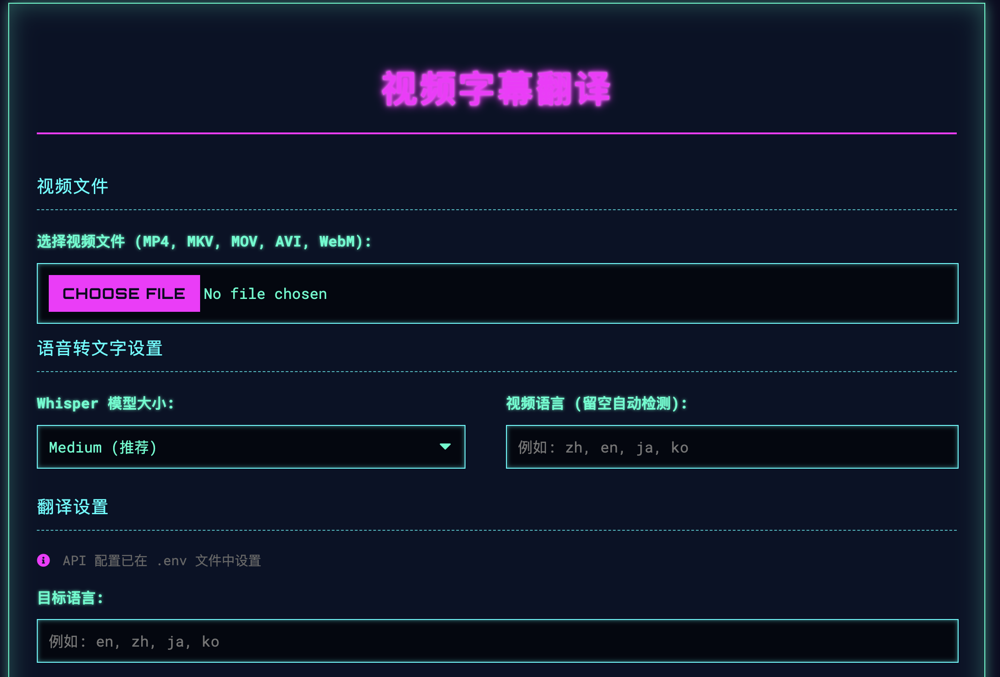
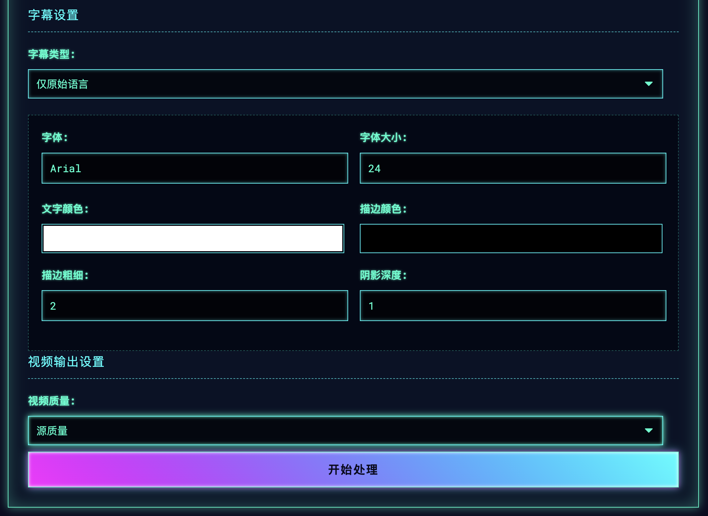

<div align="center">
  <h1>🎬 视频字幕翻译</h1>
  <p>✨ 一个强大的视频字幕生成与翻译工具，支持多语言转换和个性化字幕样式</p>
  
  [](https://www.python.org/)
  [](https://flask.palletsprojects.com/)
  [](https://openai.com/research/whisper)
  
  
  
  *图1: 应用主界面 - 上传视频并设置翻译选项*
</div>

## 🌟 主要功能

### 🎥 视频处理
- 支持多种视频格式上传 (MP4, MKV, MOV, AVI, WebM)
- 提供多种输出质量选项 (1080p, 720p, 480p, 源质量)
- 实时处理进度显示

### 🎤 语音转文字
- 使用本地Whisper模型提取视频中的对话
- 支持多种模型大小选择：
  - 🚀 Tiny (最快，精度较低)
  - ⚡ Base (平衡速度和精度)
  - 🛡️ Small (较好的平衡)
  - 🎯 Medium (推荐，最佳平衡)
  - 🏆 Large (最精确，速度较慢)

### 🌍 多语言翻译
- 支持100+种语言的互译
- 智能语言检测功能
- 批量翻译提高处理效率
- 支持双语字幕生成

### 🎨 字幕样式定制
- 自定义字体、大小和颜色
- 调整描边和阴影效果
- 实时预览字幕样式
- 支持多种字幕位置布局

### 🛠 技术特点
- 完整的错误处理和日志记录
- 跨平台兼容性
- 异步任务处理
- 响应式设计，适配各种设备

## 🖼️ 应用截图

<div align="center">
  
  <p><em>图2: 处理进度和结果展示</em></p>
</div>

## 🚀 快速开始

### 环境要求
- Python 3.8+
- FFmpeg
- 支持CUDA的GPU (推荐，非必须)

### 安装步骤

1. 克隆仓库
   ```bash
   git clone https://github.com/yourusername/video-subtitle-translator.git
   cd video-subtitle-translator
   ```

2. 创建并激活虚拟环境
   ```bash
   python -m venv venv
   source venv/bin/activate  # Linux/Mac
   # 或
   .\venv\Scripts\activate  # Windows
   ```

3. 安装依赖
   ```bash
   pip install -r requirements.txt
   ```

4. 配置环境变量
   复制 `.env.example` 为 `.env` 并填写您的API密钥

5. 运行应用
   ```bash
   python app.py
   ```

6. 打开浏览器访问
   ```
   http://localhost:5000
   ```

## 🛠 技术栈

- **前端**: HTML5, CSS3, JavaScript (ES6+)
- **后端**: Python Flask
- **语音转文字**: OpenAI Whisper
- **翻译**: 支持多种大语言模型API
- **视频处理**: FFmpeg
- **异步任务处理**: ThreadPoolExecutor

## 🤝 贡献指南

欢迎提交问题和拉取请求！对于重大更改，请先开启issue讨论您想要更改的内容。

1. Fork 项目
2. 创建功能分支 (`git checkout -b feature/AmazingFeature`)
3. 提交更改 (`git commit -m 'Add some AmazingFeature'`)
4. 推送到分支 (`git push origin feature/AmazingFeature`)
5. 开启 Pull Request

## 📄 许可证

本项目采用 MIT 许可证 - 详情请参阅 [LICENSE](LICENSE) 文件

## ✨ 特别感谢

- OpenAI 提供的 Whisper 模型
- FFmpeg 团队提供的强大视频处理工具
- 所有贡献者和用户的支持

```
burning-sub/
├── app.py                  # Flask 应用主文件
├── requirements.txt        # Python 依赖
├── README.md               # 项目说明
├── uploads/                # 存放用户上传的原始视频
├── processed_videos/       # 存放处理完成的带字幕视频
├── subtitles/              # 存放生成的SRT和ASS字幕文件
├── temp_audio/             # 临时存放提取的音频文件（处理完成后自动清理）
├── static/
│   └── js/
│       └── script.js       # 前端JavaScript，处理异步任务和进度显示
└── templates/
    └── index.html          # 前端HTML页面
```

## 安装与运行

1.  **克隆/下载项目**
    ```bash
    git clone https://github.com/yourusername/burning-sub.git
    cd burning-sub
    ```

2.  **安装依赖:**
    ```bash
    pip install -r requirements.txt
    ```
    
    您可能还需要单独安装以下依赖：
    *   **FFmpeg:** 请根据您的操作系统从 [ffmpeg.org](https://ffmpeg.org/download.html) 下载并安装，确保它在系统的PATH中。
    *   **Whisper:** 确保您已安装 PyTorch，这是 Whisper 的依赖。
      ```bash
      # 安装 PyTorch (CPU版本示例，其他版本请参考 https://pytorch.org/)
      pip install torch torchvision torchaudio
      # 安装 Whisper
      pip install openai-whisper
      ```
    *   **Pysubs2:** 用于高级字幕处理和样式应用。
      ```bash
      pip install pysubs2
      ```

3.  **配置环境变量:**
    创建 `.env` 文件并配置以下变量：
    ```env
    OPENAI_API_KEY=your_openai_api_key
    OPENAI_API_BASE=https://api.openai.com/v1  # 可选，默认为OpenAI官方API
    OPENAI_MODEL=gpt-3.5-turbo  # 可选，指定使用的模型
    TRANSLATION_BATCH_SIZE=10  # 批量翻译的大小
    TRANSLATION_MAX_RETRIES=3  # 最大重试次数
    UPLOAD_FOLDER=uploads  # 上传文件目录
    PROCESSED_FOLDER=processed_videos  # 处理后的视频目录
    SUBTITLES_FOLDER=subtitles  # 字幕文件目录
    TEMP_AUDIO_FOLDER=temp_audio  # 临时音频文件目录
    ```

4.  **运行应用:**
    ```bash
    python app.py
    ```
    应用默认会在 `http://127.0.0.1:5001/` 启动。

## 已实现功能

*   完整的视频处理流程：
    *   音频提取（使用ffmpeg）
    *   Whisper语音识别集成
    *   OpenAI API翻译（支持自定义API端点）
    *   使用ffmpeg进行字幕烧录和视频转码
*   字幕样式自定义：
    *   字体、大小、颜色、描边、阴影等样式设置
    *   支持原始、翻译后或双语字幕
*   实时进度显示和状态更新
*   异步任务处理大文件
*   完整的错误处理和日志记录


## 最新更新

*   改进了字幕文件路径处理，确保跨平台兼容性
*   优化了翻译批处理逻辑，提高翻译效率
*   增强了错误处理和日志记录
*   移除了前端API密钥输入，改为环境变量配置
*   改进了双语字幕的生成逻辑


## 已知问题/待办

*   大文件处理时可能需要优化内存使用
*   添加更多视频格式支持
*   实现字幕编辑功能
*   添加更多翻译语言支持
*   添加测试用例
*   实现用户认证和文件管理


## 未来可能的增强功能

*   **性能优化**
    *   实现更高效的视频处理流程
    *   添加批处理功能
*   **功能增强**
    *   添加更多字幕样式选项（位置、边距、背景框等）
    *   支持更多视频格式和编解码器
    *   添加字幕编辑功能
    *   支持更多翻译语言和模型
*   **用户体验**
    *   提供更直观的用户界面
    *   添加更多交互式帮助和提示
    *   实现用户账户系统和历史记录功能
*   **部署与扩展**
    *   添加Docker支持
    *   实现水平扩展以支持更多并发用户
